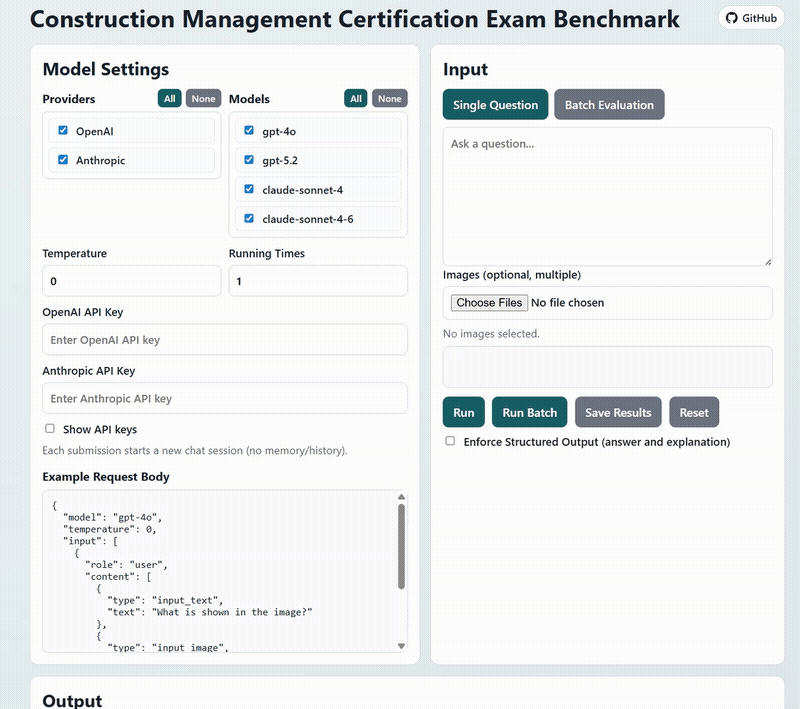

# Construction Management Certification Exam Benchmark

This web application evaluates OpenAI and Anthropic models using single prompts or batch JSONL exam datasets (with optional images). It is designed for benchmarking model performance on construction management certification exams, including AIC and CMAA.

<p align="center">
  
</p>

## Table of Contents

- [At a Glance](#at-a-glance)
- [Prerequisites](#prerequisites)
- [Start the App](#start-the-app)
- [Configure Models](#configure-models)
- [Run a Single Question](#run-a-single-question)
- [Run Batch from JSONL](#run-batch-from-jsonl)
- [JSONL Format (expected)](#jsonl-format-expected)
- [Recommended file layout (to avoid missing images)](#recommended-file-layout-to-avoid-missing-images)
- [Extend to More Models](#extend-to-more-models)
- [Resource access](#resource-access)
- [More Information](#more-information)
- [License](#license)

## At a Glance

- Purpose: benchmark LLM performance on construction management certification-style questions.
- Providers: OpenAI and Anthropic (API key required).
- Modes: single question runs and batch JSONL evaluation with optional images.
- Output: live run logs plus exportable JSON results.

## Prerequisites

- Python 3.9+ installed
- Internet access to model APIs
- OpenAI API key and/or Anthropic API key

## Start the App

```
python "./server.py" --host 127.0.0.1 --port 8000
```

Open:

`http://127.0.0.1:8000`

## Configure Models

In **Model Settings**:

1. Select one or more **Providers**.
2. Select one or more **Models**.
3. Enter API keys:
   - **OpenAI API Key**
   - **Anthropic API Key**
4. (Optional) Enable **Show API keys** to verify the typed key.
5. Set:
   - **Temperature** (`0.00` to `1.00`)
   - **Running Times** (`1` to `20`)

## Run a Single Question

1. Enter question text.
2. (Optional) Upload images.
3. Click **Run**.
4. Watch real-time output in the Output panel.
5. Click **Save Results** to export the latest run JSON.

## Run Batch from JSONL

1. In **Batch JSONL**, upload one or more `.jsonl` files.
2. Click **Run Batch**.
3. Before runs start, the app prints **image path diagnostics** (unresolved image URIs).
4. Progress bar updates while running.
5. Output streams in real time per question/model/run.
6. Review the **Result Table** under the output panel.
7. Click **Save Results** to export batch results JSON.

## JSONL Format (expected)

Each line must be one JSON object (no trailing commas). Required and optional fields:

- `id` (string, recommended)
- `question` (string, required)
- `choices` (object with `A/B/C/D`, recommended for MCQ)
- `answer` (string, optional, expected answer key for evaluation)
- `images` (array or `null`, optional)
- `table_markdown` (string or `null`, optional)

Example line:

```json
{"id":"CAC-0001","question":"...","choices":{"A":"...","B":"...","C":"...","D":"..."},"answer":"B","images":[{"uri":"data/images/CAC-0015_fig1.png"}],"table_markdown":null}
```

Notes:

- `images` can be `null` or an array.
- Each `images` item should look like: `{"uri":"relative/or/absolute/path.png","caption":"...","type":"figure"}` (caption/type optional).
- Relative `images[].uri` in uploaded JSONL may be unresolved; unresolved entries are listed in **image path diagnostics** before run starts.
- Structured output mode asks models to return JSON with keys: `answer`, `explanation`.
- A ready-to-run toy sample is included at `cert_eval/data/example_format.jsonl` with image `cert_eval/data/images/toy_blocks.png`.


### Recommended file layout (to avoid missing images)

Keep JSONL and image files under the same served root so relative URIs resolve consistently.

Example:

```text
construction-education-llm/
  cert_eval/
    data/
      CAC.jsonl
      images/
        CAC-0015_fig1.png
        CAC-0016_fig1.png
```

Then in JSONL use relative URIs like:

`"uri": "data/images/CAC-0015_fig1.png"`

And set **Batch Image Base Path** to:

`/cert_eval/`

If your images are in a different folder, either:

1. Update `images[].uri` to correct relative paths from your chosen base path, or
2. Use absolute `http(s)` image URLs.

## Extend to More Models

Model/provider options are defined in `app.js` in `providerCatalog`.

Example:

```js
const providerCatalog = {
  openai: {
    label: "OpenAI",
    endpoint: "https://api.openai.com/v1/responses",
    models: ["gpt-4o", "gpt-5.2"]
  },
  anthropic: {
    label: "Anthropic",
    endpoint: "/api/anthropic/messages",
    models: ["claude-sonnet-4-20250514", "claude-sonnet-4-6"]
  }
};
```

To add a new model version:

1. Update the `models` list under the correct provider in `providerCatalog`.
2. Save and refresh browser (`Ctrl+F5`).
3. Select the model in the UI and run a quick single test.

To add a new provider:

1. Add a new provider entry to `providerCatalog` (`label`, `endpoint`, `models`).
2. Add request payload mapping in `buildPayload(...)`.
3. Add response parsing in `parseProviderResponse(...)`.
4. Add provider key routing in `getApiKeyForProvider(...)`.
5. If browser CORS blocks direct calls, add a proxy route in `server.py` and point provider `endpoint` to local `/api/...`.

Tip for latest versions:

- Use exact official API model IDs from provider docs.
- Retire old model IDs from `providerCatalog.models` when no longer supported.

## Resource access

- AIC resources can be accessed at: https://aic-builds.org/certifications/
- CMAA exam resources are available at: https://www.cmaanet.org/bookstore
- Some source materials may require purchase or direct contact with the issuing organization for access.

## More Information

If you use this benchmark or repository, please cite:

```bibtex
@misc{xiong2025aimasterconstruction,
  title={Can AI Master Construction Management (CM)? Benchmarking State-of-the-Art Large Language Models on CM Certification Exams},
  author={Ruoxin Xiong and Yanyu Wang and Suat Gunhan and Yimin Zhu and Charles Berryman},
  year={2025},
  eprint={2504.08779},
  archivePrefix={arXiv},
  primaryClass={cs.CL},
  url={https://arxiv.org/abs/2504.08779}
}
```

## License

Code in this repository is licensed under the Apache License 2.0. See [`LICENSE`](./LICENSE).

Exam datasets, images, and third-party source materials referenced by this project may have separate terms and are not automatically covered by the repository code license. You are responsible for obtaining any required permissions for those materials.
